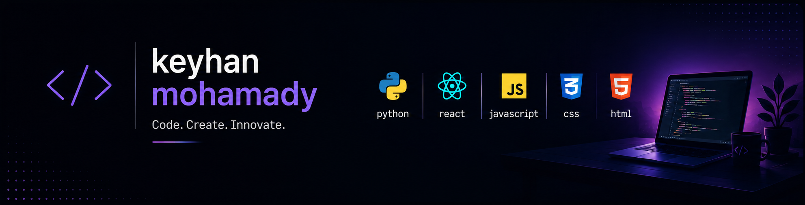

 

I'm Keyhan — a developer who enjoys building things end to end, from the AI/backend logic to the interface people actually touch.
I'm most interested in the intersection of deep learning, design, and human creativity, and I like turning ideas into real, working products.

🟢 Available for work &nbsp;·&nbsp; 📫 **keyhanmohamady0@gmail.com**

 

<h3>🛠️ Skills &amp; Technologies</h3>

 

 

<h3>🌐 Find Me</h3>

 

© 2026 Keyhan Mohamady

